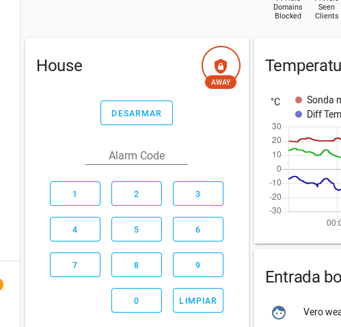

# Proyects List

## ML model for manage Home Assistant's Alarm

### hamlfeeder:
 Webapp and anothers tools for feed data to train HomeAssistant ML managed Alarm: This server saves examples with requests indicating if alarm should be enabled or disabled:
  * hptts://nginx_server/true 
  * https://nginx_server/false 
  
 saves entities's status on database and desired state of the alarm for later training purposes.
 
### ha_deep_alarm.ipynb:
 Notebook of model HA's Alarm train and evaluate

### hamlfeederclient 
 Kivy Android app for consume hamlfeeder Webapp to fill data with examples.

